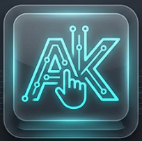

# AshKey Control

<div align="center">
  
  <br/>
  
  **System-level utility for harnessing secondary USB keyboards as dedicated macro pads.**
  
  [](https://github.com/ashvinlabs/ashkey-control)
  [](#tech-stack)
</div>

## 🚀 Overview

AshKey Control solves the "Windows Input Paradox" by implementing a **Dual-Sync Engine** that identifies and intercepts specific keyboards at the system level. This allows users to turn any standard USB number pad or keyboard into a powerful, programmable control surface without interfering with their primary typing device.

## ✨ Key Features (MVP)

- **Device Discovery**: Automatically enumerates connected HID keyboards with Vendor and Product IDs.
- **Dual-Sync Architecture**: (In Progress) Uses `RawInput` for identification and `WH_KEYBOARD_LL` hooks for interception.
- **Visual Dashboard**: A dark-themed, modern React interface for managing devices and mappings.
- **Auto-Detection**: Real-time plug-and-play support.

## 🛠️ Tech Stack

- **Core**: [Tauri v2](https://v2.tauri.app/)
- **Backend**: Rust (Windows API: `Win32_UI_Input_RawInput`, `SetupAPI`)
- **Frontend**: React + TypeScript + Vite
- **Styling**: Tailwind CSS v4

## 📦 Getting Started

### Prerequisites

- **Node.js** (v18+)
- **Rust** (Stable)
- **Visual Studio C++ Build Tools** (for Windows development)

### Installation

1.  Clone the repository:
    ```bash
    git clone git@ashvinlab-github:ashvinlabs/ashkey-control.git
    cd ashkey-control
    ```

2.  Install frontend dependencies:
    ```bash
    npm install
    ```

3.  Run the development server:
    ```bash
    npm run tauri dev
    ```

## 🗺️ Roadmap

- [x] **Phase 1: Foundation**
    - [x] Core App Structure & UI
    - [x] HID Device Enumeration
    - [x] Custom Branding & Polish
- [ ] **Phase 2: Identification & Interception**
    - [ ] "Press to Identify" Mode
    - [ ] Implement Keyboard Hook in Rust
    - [ ] "Dual-Sync" Handshake Logic
- [ ] **Phase 3: Mapping Engine**
    - [ ] UI for Key-to-Macro Assignment
    - [ ] Profile Persistence (JSON)
    - [ ] MIDI & OBS Integration

## 📄 Documentation

For a detailed breakdown of the functional requirements and technical architecture, see the [Feature Specification](docs/feature-spec.md).

## 🔒 License

**Copyright © 2026 Ashvin Labs.**

This project is licensed under the **GNU General Public License v3.0 (GPLv3)**.

- **Open Source**: You are free to use, modify, and distribute this software under the terms of the GPLv3.
- **Copyleft**: Any modifications or derivative works must also be open-sourced under the same license.
- **Commercial Usage**: Developing closed-source products based on this code is **strictly prohibited** under the GPLv3.
- **Dual Licensing**: Use of this software for proprietary or commercial purposes requires a separate commercial license from Ashvin Labs.

For commercial licensing inquiries, please contact **Ashvin Labs**.
